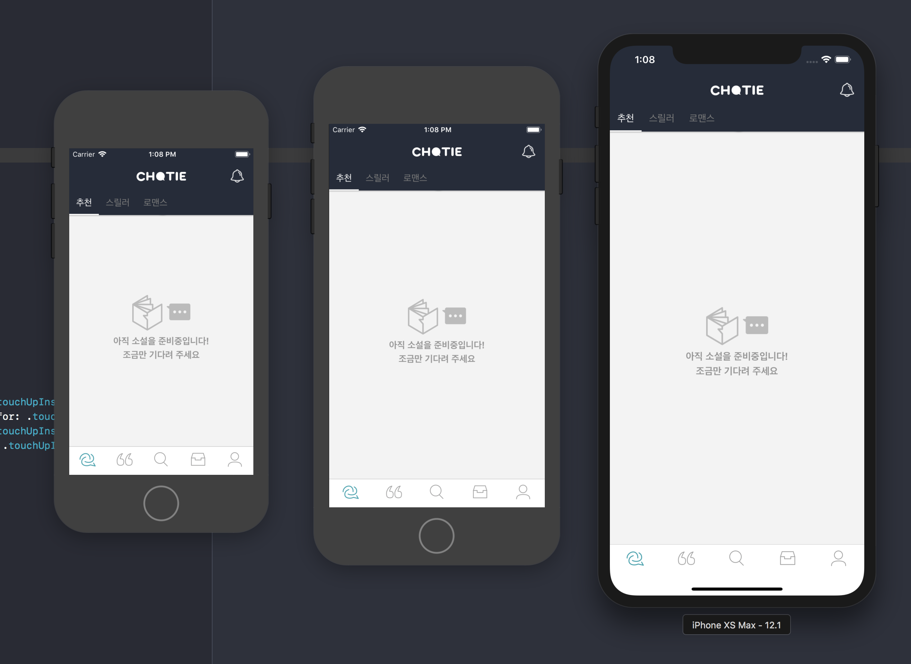
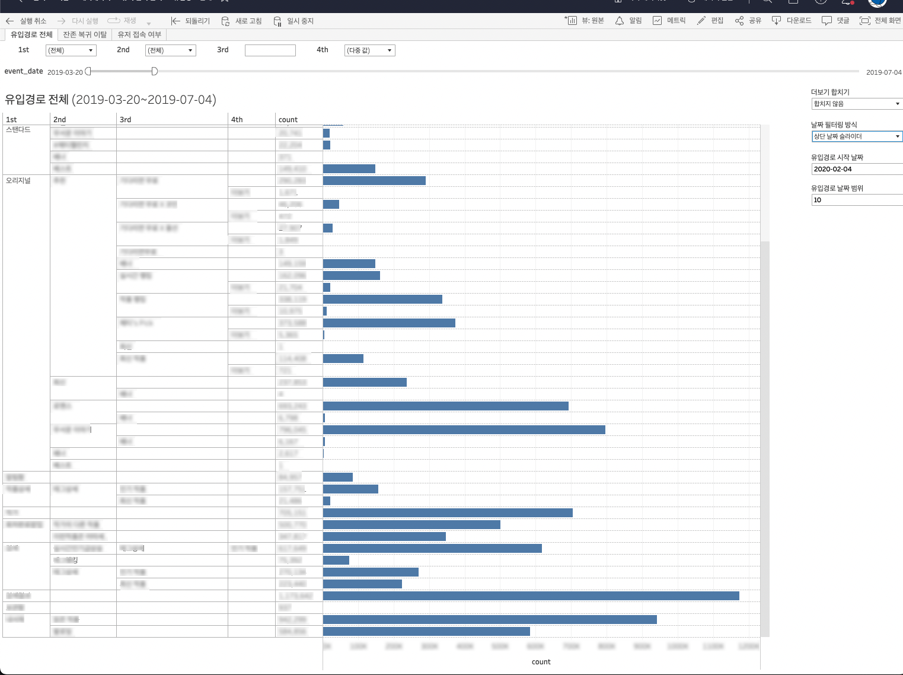
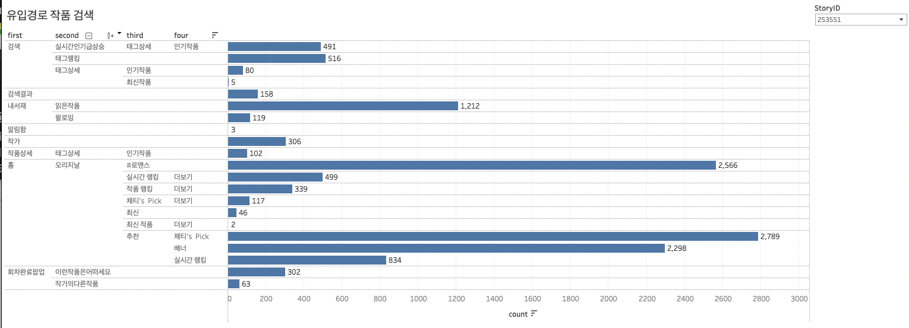
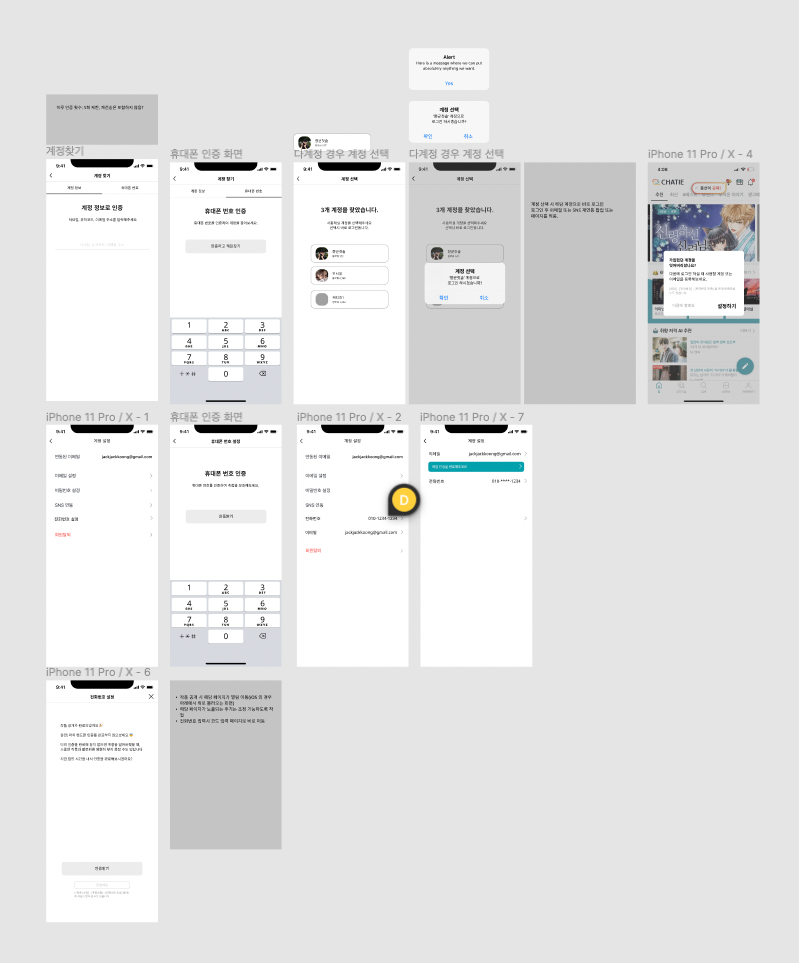
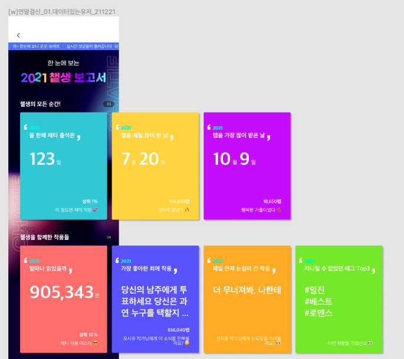
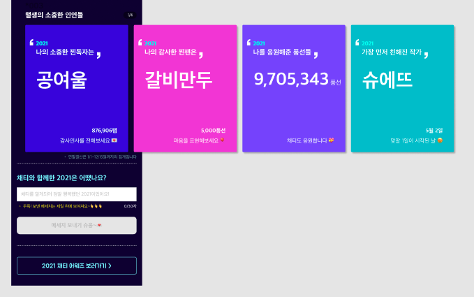
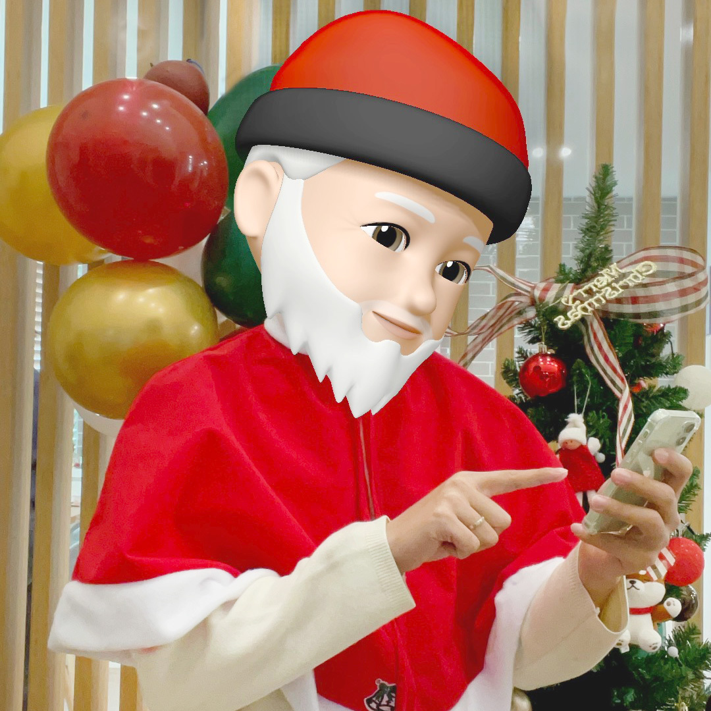
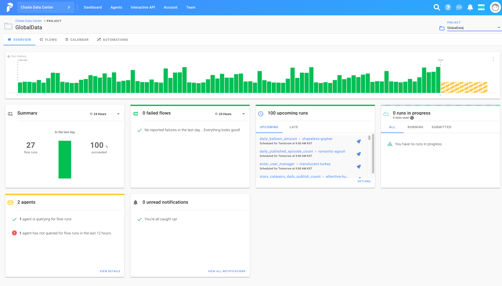

# **왕승현**

- Email: wan9seun9@gmail.com

안녕하세요. 개발자 왕승현입니다.

저는 어렸을 때부터 무언가 만드는 것을 좋아했습니다. 레고나 과학상자를 끼고 살다가 로봇에 관심을 가지게 되었고, 기회가 되어 로봇 프로그래밍 대회에 나가기도 했습니다. 그것이 제 첫 프로그래밍 경험이었습니다. 이후엔 IT 고등학교에 진학해 프로그래밍을 본격적으로 배우고 졸업 후 취업하여 개발자가 되었습니다.

제 손으로 뚝딱뚝딱 무언가를 만들어서 사람들에게 보여주고, 그 사람들이 만족해하는 모습을 볼 때 가장 심장이 두근두근합니다. 더 예쁘고 완성도 있는 모습으로 보여줄 수 있도록 항상 노력합니다. 

# **할 수 있는 것!**
- iOS 앱 개발
- 데이터 분석(Tableau, BigQuery)
- 약간의 디자인 & 포토샵
- 성장을 위해서라면 뭐든!  
  
 

# **회사 경험**
## **아이네블루메 (채티)** 
채팅형 소설 플랫폼인 채티 서비스 개발에 참여하였습니다. iOS 개발 뿐만 아니라 데이터 분석, 기획 등의 업무를 담당하였습니다.  

데이터 분석 업무를 통해 인사이트를 찾고 서비스 발전에 기여한 경험이 제 시야를 많이 넓혀 주는 계기가 되었고, 사용자들의 행동들을 꾸준히 파악하다 보니 사용자들에게 내적 친밀감이 생겨 사용자들에게 조금 더 나은, 편안한, 즐거운 서비스를 만들어 주고자 노력하게 되었습니다.  

  
  
상세내역

### **채티오 서비스 개발**  
*- 2018년 4분기*  

기존 웹 기반으로만 되어있던 채티 앱에서 오리지널 서비스만 분리하여 네이티브 앱으로 제작하였습니다.
기존 서비스와의 큰 차이는 인앱 결제를 활용한 구독 서비스를 제공한다는 점과 기존에 로딩이 느리던 웹 기능들을 네이티브 앱으로 구현하여 화면 로딩 속도를 개선시킨 점 입니다.

구독 서비스의 경우 보유 말풍선을 모두 소진할 경우(콘텐츠 말풍선 당 과금), 팝업이 노출되며 광고를 보고 말풍선을 충전하거나 구독을 하여 무제한으로 읽을 수 있는 기능입니다. 

콘텐츠 뷰어의 경우 기존 웹 코드를 사용하여 Static 파일로 추출하고 앱에서 띄우는 방식을 사용하였습니다. 보유 말풍선에 따른 로직이 필요하여 웹에서 ScriptMessageHandler를 통해 이벤트를 전달해주면 앱에서 보유 말풍선 수를 업데이트하고 말풍선 수에 따라 결제 유도 팝업을 노출하도록 개발하였습니다. 보유 말풍선 수의 경우 Realm을 사용하여 관리하였습니다. 

추후 돌아봤을 때 이 과정에서 데이터 관리에 사용할 라이브러리에 대한 고민을 조금 더 할걸 그랬다는 생각이 많이 들었습니다. 단순한 기능을 구현하는데 무거운 라이브러리를 사용하여 상당한 빌드시간에 애를 많이 먹었던 기억이 납니다. 추후 Carthage를 사용하여 빌드시간을 단축시킬 수 있었지만 다른 가벼운 라이브러리를 도입하였다면 개발 생산성이 많이 올라가지 않았을까라는 생각이 듭니다.

대기해야 하는 화면(Splash나 Refresh Control)의 경우 애니메이션을 주어 사용자가 기다리는 시간을 체감상 줄여줄 수 있도록 하고 싶었습니다. Airbnb에서 제작한 Lottie라는 json 애니메이션 라이브러리를 사용하고자 하여 디자이너님에게 Lottie에 대해 설명을 드리고 파일을 요청하였으나 제작에 어려움이 있어, 직접 lottie files에서 파일을 구해 커스텀하고 적용하였습니다.

추후 논의를 통해 출시를 하지는 못하였고, 기존 서비스에 이 당시 개발한 네이티브 기능을 부분 적용하는 것으로 진행되었습니다.  
   

### **데이터 분석 업무 시작**  
*- 2018년 4분기*   
데이터 분석 업무를 인계받아 Tableau와 빅쿼리를 학습하였습니다.  

서비스의 주요 지표나 요청받은 지표를 제작하여 모두가 볼 수 있도록 Tableau 온라인에 업로드 하였고, 매일 아침 갱신된 지표를 볼 수 있도록 작업하였습니다.

기존에 Tableau Prep을 사용하여 로컬에서 수동으로 데이터를 갱신하던 부분을 Tableau 의 추출 새로 고침 기능과 스케줄링 기능을 활용하여 자동 업데이트되도록 개선하였습니다.

사용중이던 Analytics 이벤트를 정리하였습니다. 필요한 이벤트나 각 이벤트의 파라미터를 업데이트하여 문서화하고 공유하여 업데이트된 내용을 적용시켰습니다.

   
 
### **채티 네이티브 개발**
*-2019년 1분기*  

https://user-images.githubusercontent.com/7167222/200167355-1cdc1f3a-e0d1-402c-97a3-4a8536ec4e12.mov

</img>

하나의 웹뷰로만 되어 있고 로그인 기능이 없던 기존 채티 앱에 스플래시 화면과 로그인 기능 및 화면을 추가하고 하단 탭을 추가하여 화면을 분리하였고 웹과의 소통을 위해 WebInterface를 구축하였습니다. 

ReactorKit 아키텍처를 기반으로 개발하였으며 RxSwift, RxCocoa를 적극적으로 활용하였습니다. UI의 경우 SnapKit을 사용하여 코드베이스 UI로 개발 하였습니다.

여러 카테고리의 작품을 보여줄 수 있는 큐레이션 화면과 작품 리스트 화면을 네이티브화 하였고, 읽은 작품의 정보를 저장하여 리스트에서 읽은 작품을 하이라이팅하여 확인할 수 있게 하였습니다.

추가로 AdMob을 사용하여 전면 광고 노출 기능을 추가하였고, 점검 중 여부에 따라 점검 페이지를 보여줄 수 있도록 화면 전환 로직을 변경 및 개선하였습니다.

 

### **사용자 작품 유입 경로 분석**  
*-2019년 2분기*  
네이티브화를 통해 메인화면 교체와 화면이 탭으로 분리되면서 작품에 접근하는 유입경로가 분산되었고, 어떤 유입경로를 통해 작품을 소비하는지 파악이 필요하여 화면별 유입경로 이벤트를 쌓기 시작하였고 해당 이벤트를 활용한 지표들을 제작하였습니다.  
</img>
</img>

 

### **인앱결제 및 오퍼월 기능 추가**
*-2019년 2분기*  
앱 내 재화를 얻을 수 있는 수단으로 인앱 결제 기능과 사용자가 직접 선택해 액션을 취하면 보상을 얻을 수 있는 오퍼월 기능을 추가하였습니다.

오퍼월의 경우 앱스토어 순위에 영향을 끼칠 수 있다고 하여 앱스토어로부터 자주 리젝을 받았습니다. 4가지의 오퍼월 서비스를 사용하여 매번 심사때마다 여러번 신경을 써줘야 하였습니다.  

특정 오퍼월 프레임워크의 경우 armv7, arm64에서만 빌드가 되도록하여 만들어져 전처리문을 사용해 시뮬레이터에선 해당 프레임워크 사용 부분을 호출하지 않도록 처리하여 사용하였습니다.

 

### **작품 타입별 리텐션 분석**
*-2019년 3분기*  
채티 서비스의 콘텐츠 큐레이션 탭은 오리지널, 스탠다드로 분리되어 오리지널의 경우 정식작가의 콘텐츠, 스탠다드는 일반 사용자 작가의 콘텐츠로 분리되어 있었습니다. 그 중 오리지널 탭이 메인 탭이었습니다.

사용자가 처음으로 읽게 된 작품의 작가 타입(정식 작가, 일반 사용자 작가)에 따른 리텐션 차이가 궁금해져 분석을 해보게 되었습니다. 7일 기준 일반 사용자 작가의 작품을 먼저 본 사용자의 리텐션과 퍼포먼스가 더 좋았고 이를 한 번 더 확인해 보기 위해 메인 탭의 타입으로 A/B 테스트를 진행하였습니다.

A/B 테스트 진행 결과, 스탠다드 탭을 앞으로 둔 것이 퍼포먼스가 좋게 나와 이후에도 스탠다드 탭을 메인으로 고정하게 되었습니다.

 

### **iOS 마케팅 솔루션 적용**
*-2019년 3분기*  
AppsFlyer와 Braze를 적용하였습니다.  
AppsFlyer는 마케팅 분석 솔루션으로 광고 유입 성과 측정과 원링크를 활용해 딥링크 기능을 사용할 수 있었습니다.   
Braze는 마케팅 자동화 솔루션으로 사용자의 데이터 흐름 기반으로 개인화하여 메세지를 전달할 수 있고, 손 쉽게 A/B 테스트를 구현하고 데이터를 확인할 수 있었습니다.

 

### **분석 데이터 정리**
*-2019년 4분기*  
Firebase에서 기록된 이벤트를 Bigquery에 연동하여 해당 데이터를 사용해 분석을 진행하였습니다.
쌓여가는 이벤트 데이터는 갈수록 늘어났고 태블로에서는 매번 전체 Raw 데이터에 접근하는 쿼리를 실행하였기에 빅쿼리 비용과 쿼리 시간이 늘어나기 시작하였습니다.  
비용 절감 및 쿼리의 속도 개선을 위해 빅쿼리의 예약된 쿼리 기능을 사용하여 매일 생성되는 Raw 데이터를 목적에 맞춰 각각의 테이블로 만들었고 필요에 따라 일자 파티션으로도 분리하였습니다.  
이렇게 만들어진 테이블들을 분석에 사용하기 시작해 쿼리 비용을 크게 낮추고 속도를 개선할 수 있었습니다.

   

### **오디오 녹음 기능 개발**
*-2019년 4분기*   
오디오 콘테스트 기능을 위해 AVFoundation을 사용해서 녹음, 재생 기능을 구현하였으나 추후 논의 후 콘테스트를 진행하지 않게 되어 사용하진 않았습니다.

 

### **사용자 차단 기능 기획 및 개발**
*-2019년 4분기*  
탈퇴 관련 사유 데이터를 확인하던 중 악플과 스팸으로 탈퇴하는 비율이 높다는 것을 알게 되었습니다. 악플과 스팸 댓글을 다는 사용자에 대해 작가 사용자가 직접 컨트롤할 수 있는 방법이 존재하지 않아 상당한 불편함을 느껴 이탈하게 된 것으로 보았습니다.  
이런 불편을 해소해주기 위해 사용자 차단 기능을 기획하게 되었고, 당시 디자이너의 공백으로 직접 Figma를 사용해 기존 디자인과 유사하게 디자인하여 팀원들에게 공유하였고, 서비스에 적용할 수 있었습니다.

   

### **iOS 내부 배포 개선**
*-2020년 1분기*  
그동안 직접 디바이스에 빌드를 해서 앱을 전달 하였지만 재택근무 시작 후 배포에 어려움이 생겼습니다. TestFlight를 이용한 배포에는 업로드 및 검사 시간이 오래걸려 포기하였고, Firebase App Distribution를 알게되어 이를 통해 사내 앱 배포를 진행하였습니다.

 

### **애플 로그인 적용**
*-2020년 2분기*  

https://user-images.githubusercontent.com/7167222/200167640-280891d7-f228-4926-aa7e-5ebefd2427fe.mp4

소셜 로그인을 사용할 경우 애플 로그인을 추가적으로 적용해야한다는 지침을 받아 애플 로그인을 적용하게 되었습니다. 당시 이미 4개의 소셜 로그인과 이메일 로그인을 사용하고 있어 더 이상 애플 로그인을 넣을 자리가 없었고, 디자이너의 공백으로 직접 디자인하여 적용하게 되었습니다.  

 

### **MoPub 광고 SDK 적용**
*-2020년 2분기*  
광고 수익 개선을 위한 광고 최적화 미디에이션인 MoPub을 도입하였습니다. 

 

### **꾸미기 아이템 기능 개발**
*-2020년 2분기*  

https://user-images.githubusercontent.com/7167222/200167522-12efdbf7-a387-4fe3-a7cf-cec8e736a6ce.MP4

https://user-images.githubusercontent.com/7167222/200167534-9027ecc3-38af-42e4-9b52-9195667f8d3c.MP4

사용자의 프로필과 배경을 꾸밀 수 있는 꾸미기 아이템 기능을 개발하였습니다. SDWebImage를 사용하여 png와 gif가 모두 작동할 수 있도록 구현하였습니다.

 

### **이메일 로그인 기능 개발**
*-2020년 3분기*  

https://user-images.githubusercontent.com/7167222/200167683-1b8c4b24-b65d-4c6c-b077-45f6a36089a2.mov

Firebase Auth를 사용하여 이메일 로그인을 지원하였고, 소셜 로그인 또한 옮겨와 하나의 계정에 여러 방식으로 로그인할 수 있도록 지원하였습니다.  
추가로 로그인 화면의 시작을 채티의 상징인 말풍선 형태의 온보딩 화면으로 변경하였습니다.  

 

### **커뮤니티 기능 개발**
*-2020년 4분기*  
작가가 독자들과 소통할 수 있는 수단을 만들어주고자 커뮤니티 기능을 개발하였습니다.  
기존 마이페이지의 하단영역을 작품, 커뮤니티를 탭으로 분리하여 확인할 수 있도록 개편하였습니다.  
웹에서 커뮤니티를 생성, 수정하면 네이티브에서 ScriptMessageHandler를 통해 전달받아 리스트에 업데이트하였습니다.

 

### **라이브 기능 개발**
*-2020년 4분기*  

https://user-images.githubusercontent.com/7167222/200167704-135baec2-a82a-45e3-bd60-c18d912f4b5c.mov

작가가 독자들과 실시간으로 소통할 수 있는 수단을 만들어주고자 채팅 솔루션인 Sendbird를 활용하여 실시간 채팅을 구현하였습니다.  
채팅 기능 뿐만 아니라 후원과 공지, 신고등의 기능도 지원하였습니다.  

 

### **라이브 룰렛 기능 개발**
*-2021년 1분기*  

https://user-images.githubusercontent.com/7167222/200167710-617474e6-6270-4c0a-99b6-078a55f541b4.MP4

라이브 내에서 부가적인 재미 요소 및 후원 요소를 더해주고자 룰렛 기능을 개발하였습니다.  
룰렛 UI는 SwiftFortuneWheel 라이브러리를 사용하였으나, 룰렛 종료 위치 커스텀과 animation 종료 시점 전달이 제대로 이뤄지지 않는 부분을 수정하여 사용하였습니다.

 

### **라이브 작품 같이보기 기능 개발**
*-2021년 2분기*  

https://user-images.githubusercontent.com/7167222/200167715-6205e9fa-f27d-4b65-aede-dabf0fb496c5.mp4

당시 유튜브 최초공개나 왓챠 함께보기 같은 기능이 출시될 때 였고, 기존의 작품을 감상하고 댓글을 남기며 소통하던 정적인 소통에서 창작자와 실시간으로 콘텐츠 소비를 같이 하며 소통하는 방식으로의 방향을 테스트해보고자 해당 기능 개발을 시작하게 되었습니다.  
Sendbird의 기능인 메타데이터를 활용해 작품의 정보와 말풍선 위치를 전달해 참여자들에게도 같은 화면을 볼 수 있게 하였고, 콘텐츠 뷰어는 웹뷰로 ScriptMessageHandler를 사용해 커맨드를 전달받아 작품 정보나 현재 말풍선 위치를 메타데이터에 업데이트할 수 있었습니다.  
개인적으로는 많이 아쉬웠던 프로젝트였는데 좁은 모바일 화면 안에서 세로형 콘텐츠를 보는 것과 소통을 함께 하자니 콘텐츠 뷰 + 댓글 뷰 + 키보드의 화면 배분으로 인해 사용성이 좋지 못했다고 보았습니다. 빠르게 "실시간 소통 + 소비"를 테스트 할 것이냐, UI/UX를 다듬고 갈 것이냐에 대한 많은 의논 끝에 빠르게 테스트하는 것으로 결론이 나서 그대로 진행하게 되었습니다.  

 

### **계정 분실 방지 기능 기획 및 개발**
*-2021년 3분기*  
</img>  
소셜 서비스 탈퇴, 이메일 분실 등의 이유로 채티 계정을 분실하는 사례가 많아 방지하기 위한 대책을 제공해주고자 시작하였습니다.  
계정 분실 케이스들과 계정 찾기 여정의 경험 등을 파악하고 개선안들을 정리하여 공유 후 논의를 가졌습니다. 휴대폰 본인 인증과 계정 찾기 여정 개선 방안을 도입하기로 하였고, 기능 명세 작성, 와이어 프레임 제작, 개발 진행, 결과 분석, 후속 이벤트 관리 등의 업무를 진행하였습니다.  

 

### **앱 배포 자동화**
*-2021년 4분기*  
매번 Archive하여 나온 ipa파일을 Firebase App Distribution에 직접 업로드 하던 것에 불편을 느끼고 있었는데, 여유가 생겨 fastlane + circle ci를 이용한 자동화 작업을 진행하였습니다.  
개인적인 소망은 m1 맥 미니를 이용해 로컬 빌드 머신을 만들어보고 싶었지만 사정이 여의치 않아 진행하지 못했습니다ㅜ  

 

### **2021년 연말결산 & 챝생보고서**
*-2021년 4분기*  
</img>
</img>  
2019년부터 매년 연말 시상식같은 느낌의 이벤트인 연말결산 이벤트를 진행하였습니다. 이제까지는 매번 요청오는 데이터를 뽑아 전달만 하는 업무를 맡아 왔었습니다.
이번에는 욕심을 조금 내서 직접 연말결산 이벤트를 기획해 보고싶다 하였고, 기존 이벤트에 추가로 모든 사용자가 재미를 느낄 수 있도록 개인화 연말결산(챝생보고서)을 더하는 것을 목표로 진행하였습니다.  
기획, 디자인 초안, 데이터 정리 및 가공, 결과 분석 등의 업무를 진행하였습니다.  

 

### **2021년 크리스마스 이벤트 진행**
*-2021년 4분기*  
</img>  

https://user-images.githubusercontent.com/7167222/200167729-23ab3a17-d55f-414a-bf66-11cf6d74b2e4.mov

크리스마스 기념 이벤트를 맡아 진행하였습니다. 콘텐츠 생성 촉진 및 후원 촉진 그리고 친근한 브랜드 이미지를 만드는 것을 목표로 하였습니다.  
콘텐츠 생성 촉진을 목표로 특정 태그들을 달면 화면에서 눈이 내리는 모션을 보여주거나 큐레이션에 노출되도록 하였으며, 후원 촉진 방안으로는 당일 후원을 했던 사용자 모두를 추첨 대상으로 하여 재화를 선물해 주었습니다.  
채티 산타 캐릭터(본인)를 만들어 위 이벤트들에 대한 공지를 하고, 관련 태그들로 만들어진 콘텐츠에 댓글을 남겨주거나 라이브를 통해 실시간으로 소통하는 등의 업무를 진행하였습니다.  

 

### **글로벌 채티**
*-2022년 1분기*  
미국, 인도, 캐나다, 필리핀을 대상으로 글로벌 서비스를 개발하였습니다.  
국가별 특징 조사 및 서비스 내 텍스트 번역을 관리하였습니다. 
앱 개발 업무로는 I18N을 적용하였고 홈 탭 전체가 Server Driven UI로 변경되어 개편하면서 Compositional Layout을 사용해보았습니다.

 

### **데이터 Prepect 적용**
*-2022년 2분기*  
</img>  
기존 빅쿼리 예약쿼리를 사용해 데이터 추출 스케줄링을 관리하고 있었습니다. 하지만 그동안 혼자 관리해왔기에 모두 제 계정으로 만들어진 스케줄들이었고 계정이 사라질 경우 모든 데이터 업데이트가 멈춰버리게 됩니다. 또 예약쿼리에 대한 아쉬운 점들이 계속 나오기도 했었구요. 그래서 Workflow Scheduler 솔루션을 적용해서 협업이 가능하게끔 개선하고자 하였습니다.  
aws ec2에 prefect agent를 설치하고 cloud에 연동하여 github에서 작업 코드를 불러와 실행하도록 세팅하였습니다.  

Airflow가 아닌 Prefect를 선택한 이유는 간단한 설치와 무료로 Cloud UI 지원(한달 2만 task)이 되어 가볍게 시작하기 좋아 보였고, 잠깐 Airflow를 테스트해보았을 때 실패한 태스크를 재실행하거나 실행 시간을 입력해야 태스크가 실행되는 것이 Prefect에 비해 복잡하게 느껴졌기 때문입니다.  

## **모젯 (정오의 데이트)** 
국내 최초 데이팅 서비스인 정오의 데이트 서비스 개발에 참여하였습니다. iOS 개발을 하였으며, 타 iOS 팀원과의 협업 경험을 할 수 있어 뜻 깊은 시간이었습니다.  

  
상세내역
  

### **정오의 데이트 앱 개발**  
- 신규 기능 개발 및 기존 기능 유지보수를 담당하였습니다.  
- Obj-c 코드를 Swift로 전환하였습니다.  
- ReactorKit & RxSwift를 도입에 참여하였습니다.  
- Lottie를 사용한 애니메이션 UI를 적용하였습니다.  

## **플레이윙즈** 
특가 항공권 알림 서비스인 플레이윙즈 서비스 개발에 참여하였습니다. iOS 개발 및 웹 개발을 담당하였습니다. 첫번째 회사이며 스타트업이었기에 제게는 다양한 경험을 쌓을 수 있었습니다.

  
상세내역
  

### **플레이윙즈 앱 개발**  
- 신규 기능 개발 및 기존 기능 유지보수를 담당하였습니다.  
- Obj-c 코드를 Swift로 전환하였습니다.  

 

### **플레이윙즈 웹 개발**  
- Angular JS를 사용하여 웹개발을 진행하였습니다.
- 어드민 웹 페이지의 신규 기능 개발 및 유지보수를 담당하였습니다.
- 쇼트너 서비스의 신규 기능을 개발하였습니다.

 

# **프로젝트 경험**
## **Unknown**  
https://www.tumblbug.com/letterunknown  
익명으로 모르는 사람들과 우편을 주고 받는 서비스인 Unknown 서비스를 개발하였습니다.  
기획부터 참여하기 시작해 운영(편지 제작) 및 개발을 담당하였습니다. 개발은 모두 혼자 담당하였으며 서버는 Django, 웹 사이트는 Next js를 사용하였습니다.  
사용자들 모두가 진심으로 편지를 작성하고 그 편지들을 읽으며 행복해하는 모습을 볼 수 있어 뿌듯한 경험이었습니다.  